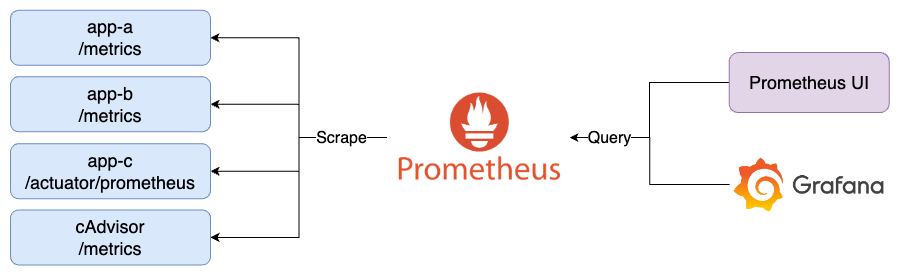
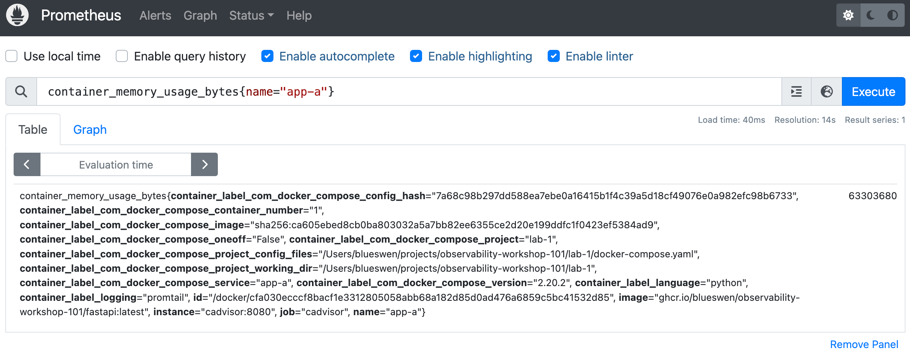
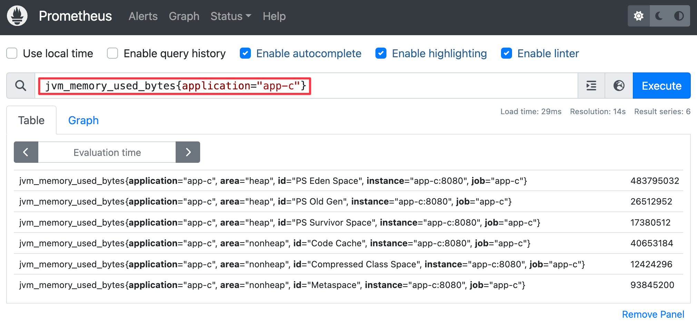
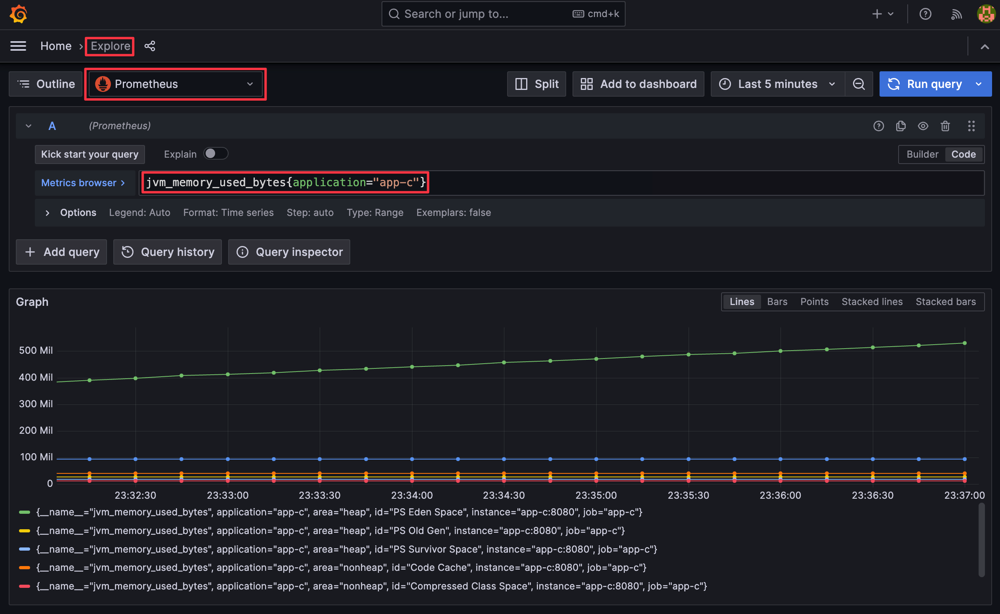

# Lab 0

透過 Prometheus、Grafana、cAdvisor 監控 Docker Container 與 Spring Boot App、FastAPI App 的 Metrics。

## Quick Start

1. 啟動所有服務

    ```bash
    docker-compose up -d
    ```

2. 檢視服務
   1. App A: [http://localhost:8000](http://localhost:8000)
      1. Swagger UI: [http://localhost:8000/docs](http://localhost:8000/docs)
      2. Metrics: [http://localhost:8000/metrics](http://localhost:8000/metrics)
   2. App B: [http://localhost:8001](http://localhost:8001)
      1. Swagger UI: [http://localhost:8001/docs](http://localhost:8001/docs)
      2. Metrics: [http://localhost:8001/metrics](http://localhost:8001/metrics)
   3. App C: [http://localhost:8080](http://localhost:8082)
      1. Swagger UI: [http://localhost:8080/swagger-ui/index.html](http://localhost:8080/swagger-ui/index.html)
      2. Metrics: [http://localhost:8080/actuator/prometheus](http://localhost:8080/actuator/prometheus)
   4. cAdvisor: [http://localhost:8081](http://localhost:8081)
   5. Prometheus: [http://localhost:9090](http://localhost:9090)
   6. Grafana: [http://localhost:3000](http://localhost:3000)，登入帳號密碼為 `admin/admin`
      1. 點擊左上 Menu > Dashboards > Cadvisor exporter、FastAPI Observability、Spring Boot Observability，即可查看透過 Provisioning 建立的 Dashboard
3. 關閉所有服務

    ```bash
    docker-compose down
    ```

## Goals



1. 建立 FastAPI App（app-a、app-b）
   1. 透過 Prometheus Client 產生 OpenMetrics，揭露於 `/metrics` endpoint
2. 建立 Spring Boot App（app-c）
   1. 透過 Spring Boot Actuator 與 Micrometer 產生 OpenMetrics，揭露於 `/actuator/prometheus` endpoint
3. 建立 cAdvisor，監控 Docker Container，Prometheus Metrics 揭露於 `/metrics` endpoint
4. 建立 Prometheus，收集 app-a、app-b、app-c、cAdvisor 的 Metrics
5. 建立 Grafana，查詢 Prometheus 資料

## Tasks

<details><summary>Task 1: 增加 Prometheus 爬取的目標，app-b, app-c</summary>

1. 編輯 `prometheus/prometheus.yml`，在 `scrape_configs` 中增加以下設定

    ```yaml
    scrape_configs:
      # ...
      - job_name: 'app-b'
        metrics_path: '/metrics'
        static_configs:
          - targets: ['app-b:8000']
      - job_name: 'app-c'
        metrics_path: '/actuator/prometheus'
        static_configs:
          - targets: ['app-c:8080']
    ```

2. 重新啟動 Prometheus

    ```bash
    docker-compose restart prometheus
    ```

</details>

<details><summary>Task 2: 使用 PromQL 語法於 Grafana 或 Prometheus UI 查詢 app-a 的 Container 記憶體使用量</summary>

- 開啟 Prometheus UI，點擊左上方的 `Graph`，輸入以下查詢語法

    ```promql
    container_memory_usage_bytes{name="app-a"}
    ```

    

- 開啟 Grafana UI，點擊左上選單後進入 `Explore` 頁籤，左上下拉選單選擇 `Prometheus` 後輸入以下查詢語法

    ```promql
    container_memory_usage_bytes{name="app-a"}
    ```

    

</details>

<details><summary>Task 3: 使用 PromQL 語法於 Grafana 或 Prometheus UI 查詢 app-c 的 JVM 記憶體使用量</summary>

- 開啟 Prometheus UI，點擊左上方的 `Graph`，輸入以下查詢語法

    ```promql
    jvm_memory_used_bytes{application="app-c"}
    ```

    

- 開啟 Grafana UI，點擊左上方的 `Explore`，輸入以下查詢語法

    ```promql
    jvm_memory_used_bytes{application="app-c"}
    ```

    

</details>
