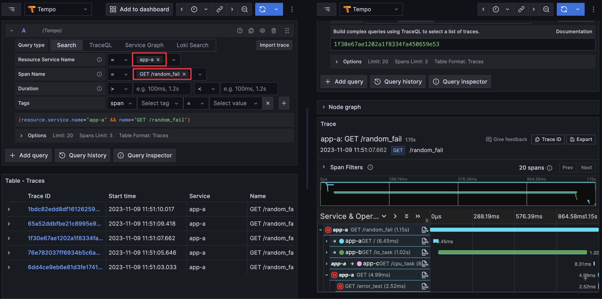
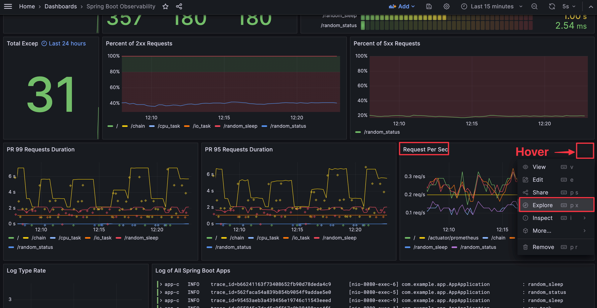
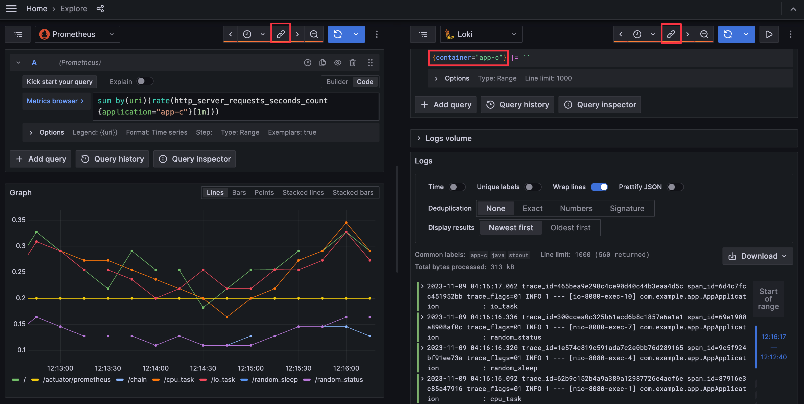
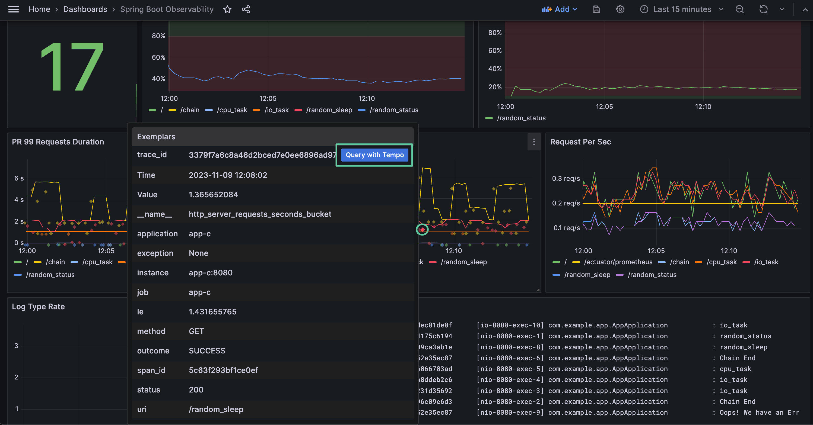

# Lab 2

根據 Lab 1 架構，將 Prometheus、Loki、Tempo 資料源透過 Grafana 的設定互相串連。

## Quick Start

1. 啟動所有服務

    ```bash
    docker-compose up -d
    ```

2. 檢視服務
   1. App A: [http://localhost:8000](http://localhost:8000)
      1. Swagger UI: [http://localhost:8000/docs](http://localhost:8000/docs)
      2. Metrics: [http://localhost:8000/metrics](http://localhost:8000/metrics)
   2. App B: [http://localhost:8001](http://localhost:8001)
      1. Swagger UI: [http://localhost:8001/docs](http://localhost:8001/docs)
      2. Metrics: [http://localhost:8001/metrics](http://localhost:8001/metrics)
   3. App C: [http://localhost:8080](http://localhost:8082)
      1. Swagger UI: [http://localhost:8080/swagger-ui/index.html](http://localhost:8080/swagger-ui/index.html)
      2. Metrics: [http://localhost:8080/actuator/prometheus](http://localhost:8080/actuator/prometheus)
   4. cAdvisor: [http://localhost:8081](http://localhost:8081)
   5. Prometheus: [http://localhost:9090](http://localhost:9090)
   6. Grafana: [http://localhost:3000](http://localhost:3000)，登入帳號密碼為 `admin/admin`
      1. 點擊左上 Menu > Dashboards > Cadvisor exporter、FastAPI Observability、Spring Boot Observability，即可查看透過 Provisioning 建立的 Dashboard
3. 關閉所有服務

    ```bash
    docker-compose down
    ```

## Goals


1. 建立 FastAPI App（app-a、app-b）
   1. 透過 Prometheus Client 產生 OpenMetrics，揭露於 `/metrics` endpoint
   2. 透過 OpenTelemetry Manual Instrumentation 產生 Trace，發送至 Tempo
   3. 透過 OpenTelemetry Manual Instrumentation 與調整 Log Pattern 將 Trace ID 與 Span ID 寫入 Log
2. 建立 Spring Boot App（app-c）
   1. 透過 Spring Boot Actuator 與 Micrometer 產生 OpenMetrics，揭露於 `/actuator/prometheus` endpoint
   2. 透過 OpenTelemetry Automatic Instrumentation 產生 Trace，發送至 Tempo
   3. 透過 OpenTelemetry Automatic Instrumentation 與調整 Log Pattern 將 Trace ID 與 Span ID 寫入 Log
3. 建立 cAdvisor，監控 Docker Container，Prometheus Metrics 揭露於 `/metrics` endpoint
4. 建立 Prometheus，收集 app-a、app-b、app-c、cAdvisor 的 Metrics
5. 建立 Promtail，收集 Container Log，發送至 Loki
6. 建立 Loki，接收 Promtail 收集的 Log
7. 建立 Tempo，接收 App A、App B、App C 發送的 Trace
8. 建立 Grafana，查詢 Prometheus、Loki、Tempo 資料

## Tasks

<details><summary>Task 1: 開啟 <a href="http://localhost:8000/random_fail" target="_blank">http://localhost:8000/random_fail</a> 執行多次直到回應錯誤頁面，透過 Trace 找到發生錯誤的 Trace 在查看對應的 Log 訊息</summary>

1. 開啟 Grafana UI，點擊左上選單後進入 `Explore` 頁籤
2. 左上下拉選單選擇 `Tempo`，Query Type 選擇 `Search`，`Resource Service Name` 選擇 `app-a`，`Span Name` 選擇 `GET /random_fail` 後點擊 `Run Query`




</details>

<details><summary>Task 2: 開啟 <a href="http://localhost:8080/" target="_blank">http://localhost:8080/</a> 執行多次後，在 Spring Boot Observability Dashboard 中查詢 App C，並於 Request Per Sec Panel 開啟 Explore 功能，於 Explore 頁籤中同時查詢對應時間 App C 的 Log</summary>





</details>

<details><summary>Task 3: 開啟 <a href="http://localhost:8000/random_sleep" target="_blank">http://localhost:8080/random_sleep</a> 執行多次後，查詢 /random_sleep 執行時間分佈的指標，並查閱收集到的 Exemplar 對應的 Trace</summary>



</details>
