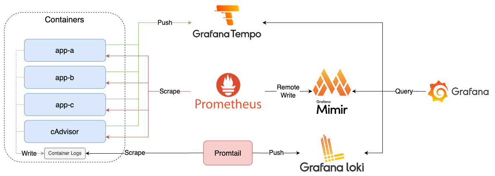

# Lab 3

將 Mimir 串連至 Lab 2 的架構中。

## Quick Start

```bash
docker-compose up -d
```

## Goals



1. 建立 FastAPI App（app-a、app-b）
   1. 透過 Prometheus Client 產生 OpenMetrics，揭露於 `/metrics` endpoint
   2. 透過 OpenTelemetry Manual Instrumentation 產生 Trace，發送至 Tempo
   3. 透過 OpenTelemetry Manual Instrumentation 與調整 Log Pattern 將 Trace ID 與 Span ID 寫入 Log
2. 建立 Spring Boot App（app-c）
   1. 透過 Spring Boot Actuator 與 Micrometer 產生 OpenMetrics，揭露於 `/actuator/prometheus` endpoint
   2. 透過 OpenTelemetry Automatic Instrumentation 產生 Trace，發送至 Tempo
   3. 透過 OpenTelemetry Automatic Instrumentation 與調整 Log Pattern 將 Trace ID 與 Span ID 寫入 Log
3. 建立 cAdvisor，監控 Docker Container，Prometheus Metrics 揭露於 `/metrics` endpoint
4. 建立 Prometheus，收集 app-a、app-b、app-c、cAdvisor 的 Metrics，並將其送至 Mimir 儲存
5. 建立 Mimir，接收 Prometheus 收集的 Metrics
6. 建立 Promtail，收集 Container Log，發送至 Loki
7. 建立 Loki，接收 Promtail 收集的 Log
8. 建立 Tempo，接收 App A、App B、App C 發送的 Trace
9. 建立 Grafana，查詢 Mimir、Loki、Tempo 資料

## Tasks

<details><summary>Task 1: 使用 PromQL 語法於 Grafana 查詢 app-a 的 Container 記憶體使用量，證明 Mimir 有取得 Prometheus 寫入的 Metrics</summary>

1. 開啟 Grafana UI，點擊左上選單後進入 `Explore` 頁籤，左上下拉選單選擇 `Prometheus` 後輸入以下查詢語法

    ```promql
    container_memory_usage_bytes{name="app-a"}
    ```

    

</details>
