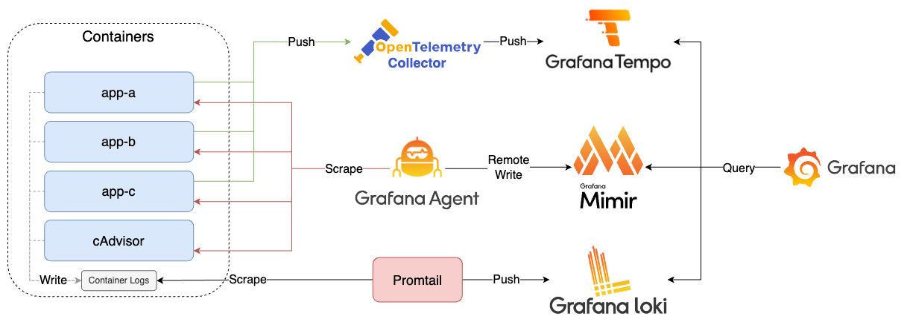
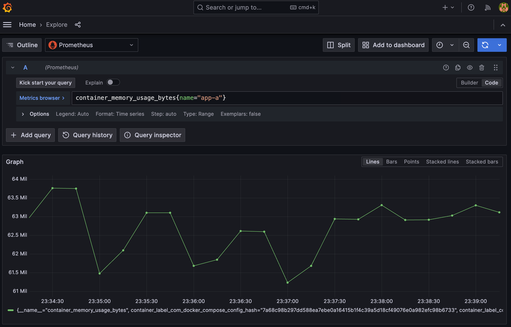
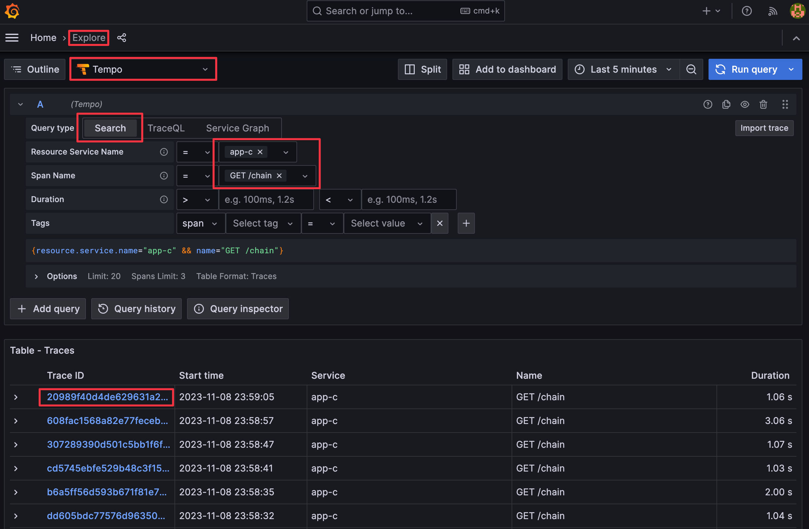
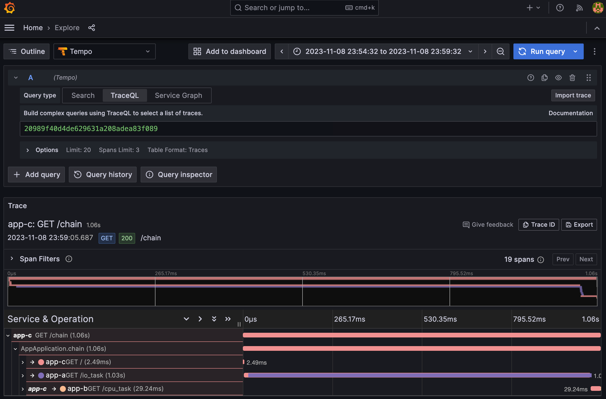

# Lab 4

將 OpenTelemetry Collector 串連至 Lab 3 的架構中，並以 Grafana Agent 取代 Prometheus。

## Quick Start

1. 啟動所有服務

    ```bash
    docker-compose up -d
    ```

2. 檢視服務
   1. App A: [http://localhost:8000](http://localhost:8000)
      1. Swagger UI: [http://localhost:8000/docs](http://localhost:8000/docs)
      2. Metrics: [http://localhost:8000/metrics](http://localhost:8000/metrics)
   2. App B: [http://localhost:8001](http://localhost:8001)
      1. Swagger UI: [http://localhost:8001/docs](http://localhost:8001/docs)
      2. Metrics: [http://localhost:8001/metrics](http://localhost:8001/metrics)
   3. App C: [http://localhost:8080](http://localhost:8082)
      1. Swagger UI: [http://localhost:8080/swagger-ui/index.html](http://localhost:8080/swagger-ui/index.html)
      2. Metrics: [http://localhost:8080/actuator/prometheus](http://localhost:8080/actuator/prometheus)
   4. cAdvisor: [http://localhost:8081](http://localhost:8081)
   5. Grafana Agent: [http://localhost:12345](http://localhost:12345)
   6. Grafana: [http://localhost:3000](http://localhost:3000)，登入帳號密碼為 `admin/admin`
      1. 點擊左上 Menu > Dashboards > Cadvisor exporter、FastAPI Observability、Spring Boot Observability，即可查看透過 Provisioning 建立的 Dashboard
3. 關閉所有服務

    ```bash
    docker-compose down
    ```

## Goals



1. 建立 FastAPI App（app-a、app-b）
   1. 透過 Prometheus Client 產生 OpenMetrics，揭露於 `/metrics` endpoint
   2. 透過 OpenTelemetry Manual Instrumentation 產生 Trace，發送至 OpenTelemetry Collector
   3. 透過 OpenTelemetry Manual Instrumentation 與調整 Log Pattern 將 Trace ID 與 Span ID 寫入 Log
2. 建立 Spring Boot App（app-c）
   1. 透過 Spring Boot Actuator 與 Micrometer 產生 OpenMetrics，揭露於 `/actuator/prometheus` endpoint
   2. 透過 OpenTelemetry Automatic Instrumentation 產生 Trace，發送至 OpenTelemetry Collector
   3. 透過 OpenTelemetry Automatic Instrumentation 與調整 Log Pattern 將 Trace ID 與 Span ID 寫入 Log
3. 建立 cAdvisor，監控 Docker Container，Prometheus Metrics 揭露於 `/metrics` endpoint
4. 建立 Grafana Agent，收集 app-a、app-b、app-c、cAdvisor 的 Metrics，並將其送至 Mimir 儲存
5. 建立 Mimir，接收 Prometheus 收集的 Metrics
6. 建立 Promtail，收集 Container Log，發送至 Loki
7. 建立 Loki，接收 Promtail 收集的 Log
8. 建立 OpenTelemetry Collector，接收 App A、App B、App C 發送的 Trace，並將其送至 Tempo
9. 建立 Tempo，接收 App A、App B、App C 發送的 Trace
10. 建立 Grafana，查詢 Mimir、Loki、Tempo 資料

## Tasks

<details><summary>Task 1: 使用 PromQL 語法於 Grafana 查詢 app-a 的 Container 記憶體使用量，驗證 Grafana Agent 有爬取 Metrics 並寫入 Mimir</summary>

1. 開啟 Grafana UI，點擊左上選單後進入 `Explore` 頁籤，左上下拉選單選擇 `Prometheus` 後輸入以下查詢語法

    ```promql
    container_memory_usage_bytes{name="app-a"}
    ```

    

</details>

<details><summary>Task 2: 開啟 <a href="http://localhost:8080/chain" target="_blank">http://localhost:8080/chain</a> 後，查詢 App C 該筆 Request 的 Trace，驗證 OpenTelemetry Collector 接受到 Trace 後有轉發給 Tempo</summary>

1. 開啟 Grafana UI，點擊左上選單後進入 `Explore` 頁籤
2. 左上下拉選單選擇 `Tempo`，Query Type 選擇 `Search`，`Resource Service Name` 選擇 `app-c`，`Span Name` 選擇 `GET /chain` 後點擊 `Run Query`





</details>
