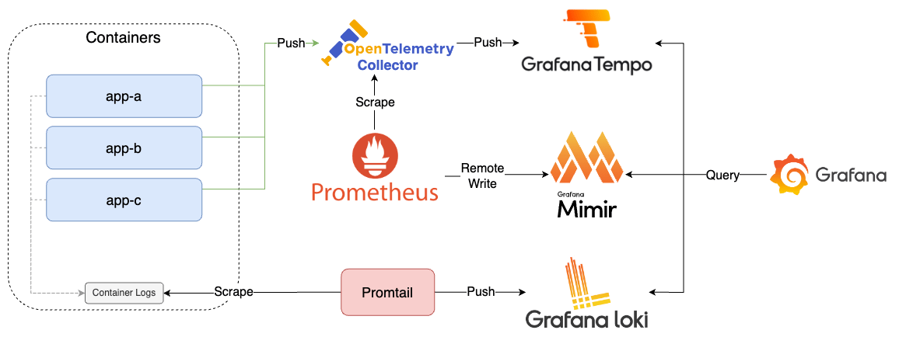

# Lab 5

利用 OpenTelemetry Collector Span Metrics Connector 將 Span 轉換為 Metrics，並透過 Prometheus 爬取收集。

## Quick Start

1. 啟動所有服務

    ```bash
    docker-compose up -d
    ```

2. 檢視服務
   1. App A: [http://localhost:8000](http://localhost:8000)
      1. Swagger UI: [http://localhost:8000/docs](http://localhost:8000/docs)
      2. Metrics: [http://localhost:8000/metrics](http://localhost:8000/metrics)
   2. App B: [http://localhost:8001](http://localhost:8001)
      1. Swagger UI: [http://localhost:8001/docs](http://localhost:8001/docs)
      2. Metrics: [http://localhost:8001/metrics](http://localhost:8001/metrics)
   3. App C: [http://localhost:8080](http://localhost:8082)
      1. Swagger UI: [http://localhost:8080/swagger-ui/index.html](http://localhost:8080/swagger-ui/index.html)
      2. Metrics: [http://localhost:8080/actuator/prometheus](http://localhost:8080/actuator/prometheus)
   4. Prometheus: [http://localhost:9090](http://localhost:9090)
   5. Grafana: [http://localhost:3000](http://localhost:3000)，登入帳號密碼為 `admin/admin`
      1. 點擊左上 Menu > Dashboards > OpenTelemetry APM，即可查看透過 Provisioning 建立的 Dashboard
         1. 透過 [k6](https://k6.io/) 執行測試腳本 `k6 run --vus 3 --duration 300s k6-script.js`，產生 Trace 資料
3. 關閉所有服務

    ```bash
    docker-compose down
    ```

## Goals



1. 建立 FastAPI App（app-a、app-b）
   1. 透過 OpenTelemetry Manual Instrumentation 產生 Trace，發送至 OpenTelemetry Collector
   2. 透過 OpenTelemetry Manual Instrumentation 與調整 Log Pattern 將 Trace ID 與 Span ID 寫入 Log
2. 建立 Spring Boot App（app-c）
   1. 透過 OpenTelemetry Automatic Instrumentation 產生 Trace，發送至 OpenTelemetry Collector
   2. 透過 OpenTelemetry Automatic Instrumentation 與調整 Log Pattern 將 Trace ID 與 Span ID 寫入 Log
3. 建立 Promtail，收集 Container Log，發送至 Loki
4. 建立 Loki，接收 Promtail 收集的 Log
5. 建立 OpenTelemetry Collector
   1. 接收 Traces 資料，將 Traces 資料轉送至 Tempo 並透過 Span Metrics Connector 產生 Metrics
   2. 接收 Span Metrics Connector 產生的 Metrics 資料，並揭露於自己的 8889 Port 供 Prometheus 爬取
6. 建立 Prometheus，收集 OpenTelemetry Collector 的 Metrics
7. 建立 Tempo，接收 App A、App B、App C 發送的 Trace
8. 建立 Grafana，查詢 Prometheus、Loki、Tempo 資料
